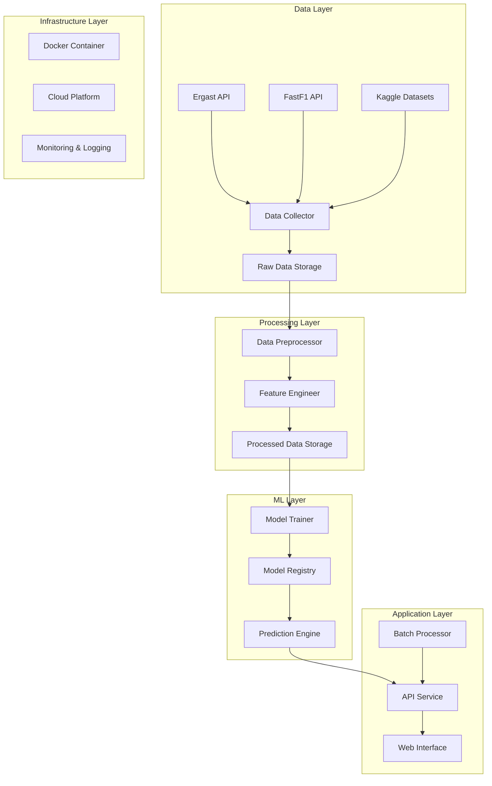

# Design Document

## Overview

The F1 Race Prediction System is designed as a modular, scalable machine learning application that predicts Formula 1 race finishing positions. The system follows a pipeline architecture with distinct phases for data collection, feature engineering, model training, and prediction serving through a web interface.

The core prediction approach uses ensemble learning with multiple algorithms (Random Forest, XGBoost, LightGBM) to predict finishing positions as a ranking problem rather than simple classification, ensuring more accurate relative position predictions.

## Architecture

The system follows a layered architecture with clear separation of concerns:



### Key Architectural Decisions

1. **Microservices Approach**: Separate services for data collection, model training, and prediction serving to enable independent scaling and deployment
2. **Event-Driven Processing**: Use message queues for asynchronous data processing and model retraining
3. **Model Versioning**: Implement model registry with versioning to support A/B testing and rollbacks
4. **Caching Strategy**: Cache frequently accessed data and predictions to improve response times

## Components and Interfaces

### Data Collection Service

**Purpose**: Collect and aggregate F1 data from multiple sources

**Key Classes**:
- `ErgastAPIClient`: Handles race results, standings, and driver data
- `FastF1Client`: Retrieves telemetry, weather, and session data
- `DataValidator`: Ensures data quality and consistency
- `DataStorage`: Manages raw data persistence

**Interfaces**:
```python
class DataCollector:
    def collect_race_data(self, season: int, round: int) -> RaceData
    def collect_historical_data(self, start_year: int, end_year: int) -> List[RaceData]
    def validate_data(self, data: RaceData) -> ValidationResult
```

### Feature Engineering Service

**Purpose**: Transform raw F1 data into machine learning features

**Key Classes**:
- `FeatureExtractor`: Creates base features from raw data
- `RollingStatsCalculator`: Computes rolling averages and trends
- `TrackSpecificFeatures`: Generates track-specific performance metrics
- `WeatherFeatures`: Processes weather impact features

**Interfaces**:
```python
class FeatureEngineer:
    def extract_driver_features(self, driver_data: DriverData) -> DriverFeatures
    def calculate_rolling_stats(self, races: List[RaceData], window: int) -> RollingStats
    def encode_categorical_features(self, features: RawFeatures) -> EncodedFeatures
```

### Model Training Service

**Purpose**: Train and evaluate prediction models

**Key Classes**:
- `ModelTrainer`: Orchestrates training pipeline
- `EnsembleModel`: Combines multiple algorithms
- `CrossValidator`: Implements time-series cross-validation
- `MetricsCalculator`: Computes evaluation metrics

**Interfaces**:
```python
class ModelTrainer:
    def train_model(self, features: Features, targets: Targets) -> TrainedModel
    def evaluate_model(self, model: TrainedModel, test_data: TestData) -> Metrics
    def tune_hyperparameters(self, model_type: str, param_space: dict) -> BestParams
```

### Prediction Service

**Purpose**: Generate race predictions using trained models

**Key Classes**:
- `PredictionEngine`: Main prediction orchestrator
- `ModelEnsemble`: Combines predictions from multiple models
- `ConfidenceCalculator`: Computes prediction confidence scores
- `ResultsFormatter`: Formats predictions for display

**Interfaces**:
```python
class PredictionEngine:
    def predict_race(self, race_params: RaceParameters) -> RacePrediction
    def predict_batch(self, batch_params: List[RaceParameters]) -> List[RacePrediction]
    def get_prediction_confidence(self, prediction: RacePrediction) -> ConfidenceScore
```

### Web Interface Service

**Purpose**: Provide user interface for predictions

**Key Classes**:
- `StreamlitApp`: Main web application
- `InputValidator`: Validates user inputs
- `VisualizationEngine`: Creates charts and graphs
- `FileProcessor`: Handles CSV uploads

**Interfaces**:
```python
class WebInterface:
    def render_input_form(self) -> UserInputs
    def display_predictions(self, predictions: RacePrediction) -> None
    def generate_visualizations(self, data: PredictionData) -> Charts
```

## Data Models

### Core Data Structures

```python
@dataclass
class RaceData:
    season: int
    round: int
    circuit_id: str
    date: datetime
    results: List[RaceResult]
    qualifying: List[QualifyingResult]
    weather: WeatherData

@dataclass
class RaceResult:
    driver_id: str
    constructor_id: str
    grid_position: int
    final_position: int
    points: float
    fastest_lap: Optional[LapTime]
    status: str

@dataclass
class DriverFeatures:
    driver_id: str
    recent_form: float  # Rolling average of recent finishes
    constructor_performance: float
    track_experience: int
    weather_performance: float
    qualifying_delta: float  # Difference from expected qualifying position

@dataclass
class RacePrediction:
    predicted_positions: List[PositionPrediction]
    confidence_scores: List[float]
    overtaking_probabilities: Dict[str, float]
    insights: List[str]

@dataclass
class PositionPrediction:
    driver_id: str
    predicted_position: int
    probability_distribution: List[float]  # Probability for each position
    expected_points: float
```

### Database Schema

**Tables**:
- `races`: Race metadata and results
- `drivers`: Driver information and career stats
- `constructors`: Team information and performance
- `circuits`: Track characteristics and layout data
- `weather`: Weather conditions for each session
- `features`: Engineered features for model training
- `predictions`: Historical predictions and accuracy tracking

## Error Handling

### Data Collection Errors

1. **API Unavailability**: Implement exponential backoff retry logic with circuit breaker pattern
2. **Data Quality Issues**: Validate data integrity and flag anomalies for manual review
3. **Rate Limiting**: Respect API rate limits with intelligent request scheduling

```python
class DataCollectionError(Exception):
    def __init__(self, source: str, error_type: str, message: str):
        self.source = source
        self.error_type = error_type
        super().__init__(message)

class ErrorHandler:
    def handle_api_error(self, error: APIError) -> RetryStrategy
    def handle_data_validation_error(self, error: ValidationError) -> DataCleaningAction
    def log_error(self, error: Exception, context: dict) -> None
```

### Model Training Errors

1. **Insufficient Data**: Implement minimum data requirements and graceful degradation
2. **Training Failures**: Automatic fallback to simpler models if complex models fail
3. **Performance Degradation**: Monitor model performance and trigger retraining

### Prediction Errors

1. **Missing Features**: Use feature imputation strategies for missing driver/track data
2. **Model Unavailability**: Fallback to ensemble of available models
3. **Invalid Inputs**: Comprehensive input validation with user-friendly error messages

## Testing Strategy

### Unit Testing

- **Data Collection**: Mock API responses and test data parsing logic
- **Feature Engineering**: Test feature calculations with known inputs/outputs
- **Model Training**: Test training pipeline with synthetic data
- **Prediction Engine**: Test prediction logic with pre-trained models

### Integration Testing

- **End-to-End Pipeline**: Test complete data flow from collection to prediction
- **API Integration**: Test real API connections with rate limiting
- **Database Operations**: Test data persistence and retrieval

### Performance Testing

- **Load Testing**: Simulate concurrent prediction requests
- **Data Volume Testing**: Test with full historical dataset
- **Model Performance**: Benchmark prediction accuracy against baselines

### Validation Strategy

```python
class ModelValidator:
    def time_series_split(self, data: DataFrame, n_splits: int) -> List[TrainTestSplit]
    def cross_validate_by_season(self, model: Model, data: DataFrame) -> CVResults
    def validate_prediction_accuracy(self, predictions: List[Prediction], 
                                   actual: List[Result]) -> AccuracyMetrics
```

**Validation Metrics**:
- Spearman Rank Correlation: Measures ranking accuracy
- Mean Absolute Error: Average position prediction error
- Top-K Accuracy: Accuracy for predicting top 3, 5, 10 finishers
- Kendall's Tau: Alternative ranking correlation metric

### Model Evaluation Framework

1. **Temporal Validation**: Train on historical data, validate on future races
2. **Track-Specific Validation**: Evaluate performance across different circuit types
3. **Driver-Specific Validation**: Assess prediction accuracy for different driver skill levels
4. **Weather Condition Validation**: Test model performance in various weather scenarios

The testing strategy ensures robust model performance across different conditions and maintains prediction quality as new data becomes available.